# 为什么要有代码管理

小明笨笨志强

因为开发过程中有很多人分工合作 大家都要修改代码 而且代码修改后 可能还要还原回去 不一定每一次修改都是正确的,再加上不同时间要发布不同的版本 所以代码必须进行管理要不全乱了。

代码管理的好处

+ 多人协作
+ 历史版本回溯
+ 多份备份
+ 进度配合和管理
+ 程序员必备技能

## git诞生

1991年Linux诞生，从此，Linux系统不断发展，已经成为最大的服务器系统软件了。

Linus虽然创建了Linux，但Linux的壮大是靠全世界热心的志愿者参与的，这么多人在世界各地为Linux编写代码，那Linux的代码是如何管理的呢？

事实是，在2002年以前，世界各地的志愿者把源代码文件通过diff的方式发给Linus，然后由Linus本人通过手工方式合并代码！

Linus Torvalds 在 2002 年起，使用 BitMover 的版本控制软件 BitKeeper 管理 Linux 核心开发，而因为 BitKeeper 除商业付费版本，仅提供可免费使用但不允许修改重新编译的精简版本，引起了开源社区的不满，如自由软件之父 Richard stallman 也敢严厉批评 Linux Torvalds 使用非自由软件开发 Linux 核心。

在 2005 年，Samba 档案服务器开发人 Andrew Tridgell 写了连接 BitKeeper 存储库的简单程序，被 BitMover 创办人 Larry McVoy 指控对 BitKeeper 进行逆向工程，因为决定停止 BitKeeper 对 Linux 的支持。

顿时 Linux 核心开发受到了严峻的挑战，而 Linus Torvalds 秉承自己的版本自己写的精神，整个周末都不见人影，隔周却如变戏法般带着 Git 出现。

### git和svn对比
1.git是分布式的，SVN不是
2.git把内容按元数据方式存储，而SVN是按文件
3.git分支和SVN的分支不同
4.git的内容完整性要优于SVN

# git原理

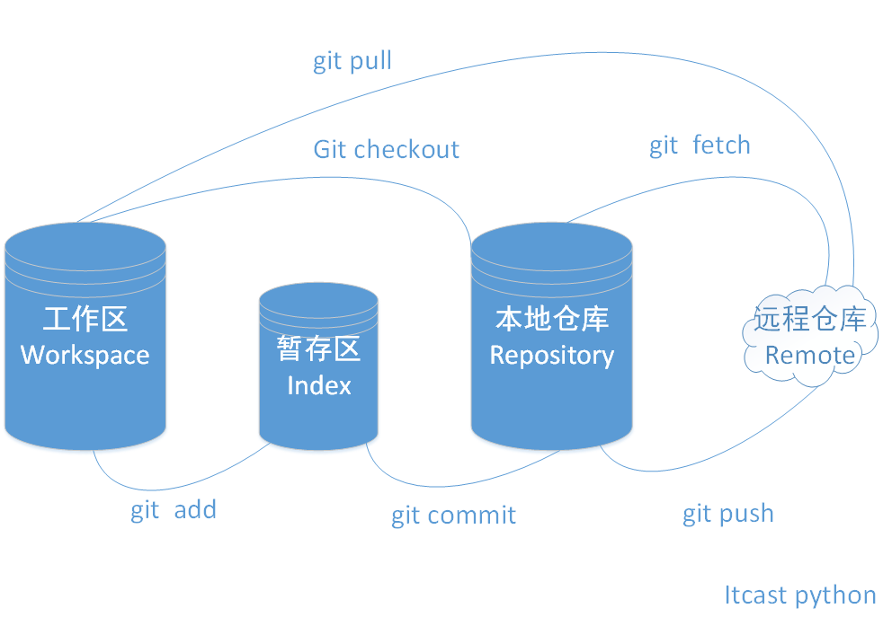

# git命令大全

## 新建代码仓库

```shell
# 在当前目录新建一个Git代码库
$ git init

# 新建一个目录，将其初始化为Git代码库
$ git init [project-name]

# 下载一个项目和它的整个代码历史
$ git clone [url]
```

## 配置

Git的设置文件为.gitconfig，它可以在用户主目录下（全局配置），也可以在项目目录下（项目配置）。

```shell
# 显示当前的Git配置
$ git config --list

# 编辑Git配置文件
$ git config -e [--global]

# 设置提交代码时的用户信息
$ git config [--global] user.name "[name]"
$ git config [--global] user.email "[email address]"
```

## 增加/删除文件

```shell
# 添加指定文件到暂存区
$ git add [file1] [file2] ...

# 添加指定目录到暂存区，包括子目录
$ git add [dir]

# 添加当前目录的所有文件到暂存区
$ git add .

# 删除工作区文件，并且将这次删除放入暂存区
$ git rm [file1] [file2] ...

# 改名文件，并且将这个改名放入暂存区
$ git mv [file-original] [file-renamed]
```

## 代码提交

```shell
# 提交暂存区到仓库区
$ git commit -m [message]

# 提交暂存区的指定文件到仓库区
$ git commit [file1] [file2] ... -m [message]

# 提交工作区自上次commit之后的变化，直接到仓库区
$ git commit -a

# 使用一次新的commit，替代上一次提交
# 如果代码没有任何新变化，则用来改写上一次commit的提交信息
$ git commit --amend -m [message]

# 重做上一次commit，并包括指定文件的新变化
$ git commit --amend [file1] [file2] ...
```


## 分支

```shell
# 列出所有本地分支
$ git branch

# 列出所有远程分支
$ git branch -r

# 列出所有本地分支和远程分支
$ git branch -a

# 新建一个分支，但依然停留在当前分支
$ git branch [branch-name]

# 新建一个分支，并切换到该分支
$ git checkout -b [branch]

# 新建一个分支，指向指定commit
$ git branch [branch] [commit]

# 新建一个远程分支，本地新建然后推送
$ git push origin [branch] 

# 新建一个分支，与指定的远程分支建立追踪关系
$ git branch --track [branch] [remote-branch]

# 切换到指定分支，并更新工作区
$ git checkout [branch-name]

# 切换到上一个分支
$ git checkout -

# 建立追踪关系，设置当前分支与指定的远程分支之间关联
$ git branch --set-upstream-to [remote-branch]

# 合并指定分支到当前分支
$ git merge [branch]

# 选择一个commit，合并进当前分支
$ git cherry-pick [commit]

# 删除分支
$ git branch -d [branch-name]

# 删除远程分支
$ git push origin --delete [branch-name]
$ git branch -dr [remote/branch]
```

## 标签

```shell
# 列出所有tag
$ git tag

# 新建一个tag在当前commit
$ git tag [tag]

# 新建一个tag在指定commit
$ git tag [tag] [commit]

# 删除本地tag
$ git tag -d [tag]

# 删除远程tag
$ git push origin :refs/tags/[tagName]

# 查看tag信息
$ git show [tag]

# 提交指定tag
$ git push [remote] [tag]

# 提交所有tag
$ git push [remote] --tags

# 新建一个分支，指向某个tag
$ git checkout -b [branch] [tag]
```

## 查看信息

```shell
# 显示有变更的文件
$ git status

# 显示当前分支的版本历史
$ git log

# 显示commit历史，以及每次commit发生变更的文件
$ git log --stat

# 搜索提交历史，根据关键词
$ git log -S [keyword]

# 显示某个commit之后的所有变动，每个commit占据一行
$ git log [tag] HEAD --pretty=format:%s

# 显示某个commit之后的所有变动，其"提交说明"必须符合搜索条件
$ git log [tag] HEAD --grep feature

# 显示某个文件的版本历史，包括文件改名
$ git log --follow [file]
$ git whatchanged [file]

# 显示指定文件相关的每一次diff
$ git log -p [file]

# 显示过去5次提交
$ git log -5 --pretty --oneline

# 显示所有提交过的用户，按提交次数排序
$ git shortlog -sn

# 显示指定文件是什么人在什么时间修改过
$ git blame [file]

# 显示暂存区和工作区的差异
$ git diff

# 显示暂存区和上一个commit的差异
$ git diff --cached [file]

# 显示工作区与当前分支最新commit之间的差异
$ git diff HEAD

# 显示两次提交之间的差异
$ git diff [first-branch]...[second-branch]


# 显示某次提交的元数据和内容变化
$ git show [commit]

# 显示某次提交发生变化的文件
$ git show --name-only [commit]

# 显示某次提交时，某个文件的内容
$ git show [commit]:[filename]

# 显示当前分支的最近几次提交
$ git reflog
```

## 远程同步

```shell
# 下载远程仓库的所有变动
$ git fetch [remote]

# 显示所有远程仓库
$ git remote -v

# 显示某个远程仓库的信息
$ git remote show [remote]

# 增加一个新的远程仓库，并命名
$ git remote add [shortname] [url]

# 取回远程仓库的变化，并与本地分支合并
$ git pull [remote] [branch]

# 上传本地指定分支到远程仓库
$ git push [remote] [branch]

# 强行推送当前分支到远程仓库，即使有冲突
$ git push [remote] --force

# 推送所有分支到远程仓库
$ git push [remote] --all
```

## 撤销

```shell
# 恢复暂存区的指定文件到工作区
$ git checkout [file]

# 恢复某个commit的指定文件到暂存区和工作区
$ git checkout [commit] [file]

# 恢复暂存区的所有文件到工作区
$ git checkout .

# 重置暂存区的指定文件，与上一次commit保持一致，但工作区不变
$ git reset [file]

# 重置暂存区与工作区，与上一次commit保持一致
$ git reset --hard

# 重置当前分支的指针为指定commit，同时重置暂存区，但工作区不变
$ git reset [commit]

# 重置当前分支的HEAD为指定commit，同时重置暂存区和工作区，与指定commit一致
$ git reset --hard [commit]

# 重置当前HEAD为指定commit，但保持暂存区和工作区不变
$ git reset --keep [commit]

# 新建一个commit，用来撤销指定commit
# 后者的所有变化都将被前者抵消，并且应用到当前分支
$ git revert [commit]

# 暂时将未提交的变化移除，稍后再移入
$ git stash
$ git stash pop
```

## 其他

```shell
# 生成一个可供发布的压缩包
$ git archive

# 删除项目的git管理
$ rm .git

```


# github

GitHub于2008年上线，目前，除了Git代码仓库托管及基本的Web管理界面以外，还提供了订阅、讨论组、文本渲染、在线文件编辑器、协作图谱（报表）、代码片段分享（Gist）等功能。正因为这些功能所提供的便利，又经过长期的积累，GitHub的用户活跃度很高，在开源世界里享有深远的声望，形成了所谓的社交化编程文化（Social Coding）。

GitHub允许你免费创建不限数量的“公开”代码仓库，虽有总的资源限额，但一般情况下够用。如果不想公开代码，或者你的代码占用存储空间比较多，你也可以选择成为付费的会员。在GitHub，想要接触高水平的软件项目，了解最前沿的技术趋势，和上微博一样简单。

Github 在代码托管领域是先行者，现在强力的竞争对手也有不少，包括 Gitlab（局域网部署）、Bitbucket（免费账号不限 private 项目个数）、GitCafe（对国内开发者来说可能有墙内优势）。


## 注册

登陆github网站

    https://github.com


## 创建一个项目

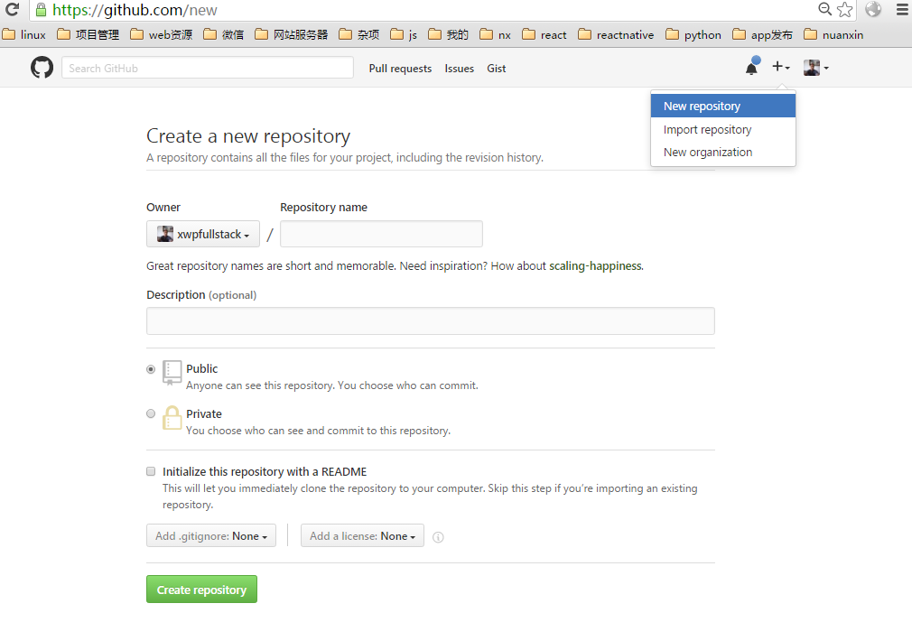

+ 创建一个python项目

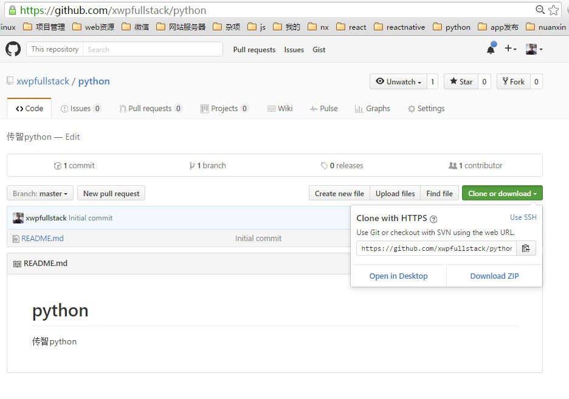

+ clone项目

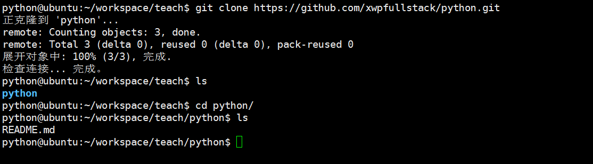

+ 第一次使用需配置用户名和邮箱

```shell

$ git config --global user.name "xxx"
$ git config --global user.email "xxx@itcast.com"

```

+ 完成第一次提交代码

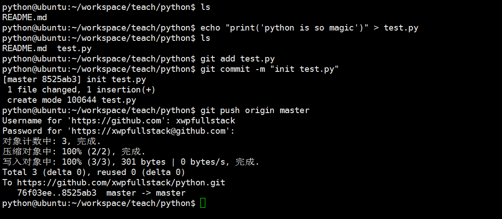

+ 刷新查看github上的对应项目

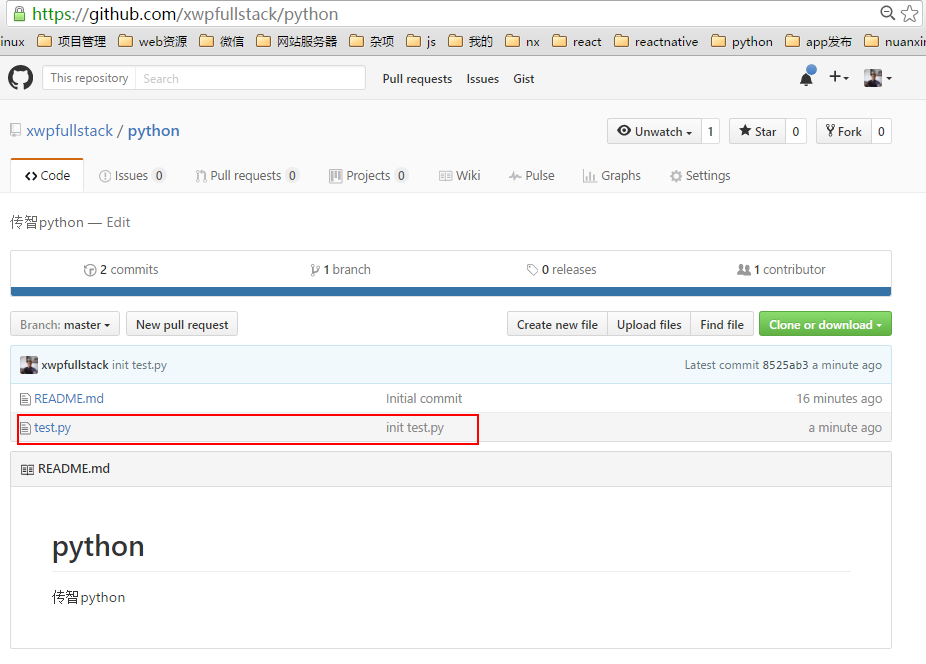


## ssh配置

+ 可以为项目配置身份秘钥，这样不必每次推送都输入账号和密码

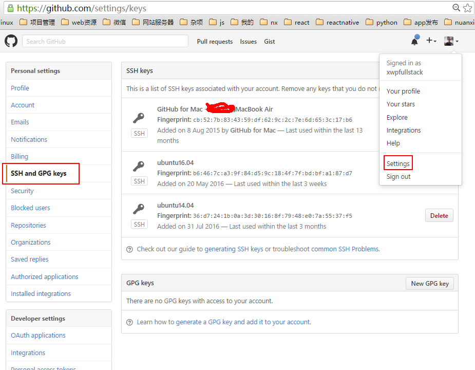

+ ubuntu下生成当前电脑ssh秘钥

```shell
# 一路敲回车
$ ssh-keygen

```
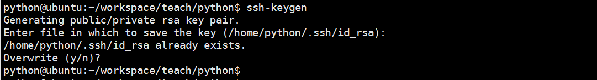

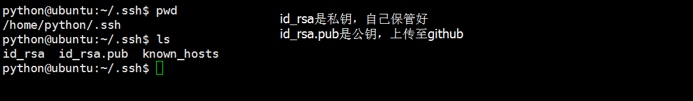

+ 把公钥上传至github作为ssh keys

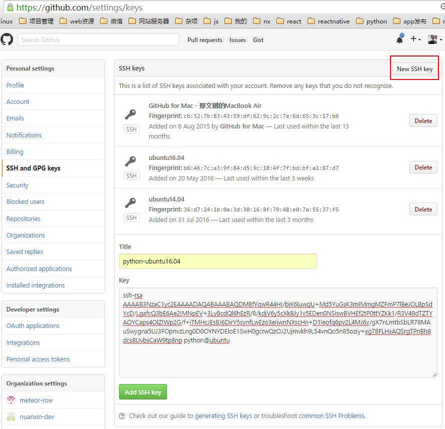

+ 修改项目的配置文件为ssh方式,编辑项目里的.git/config文件

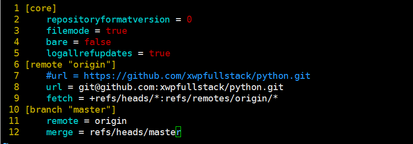

+ 修改项目代码，再次提交，无须输入账号和密码

+ 协作，添加可对项目进行

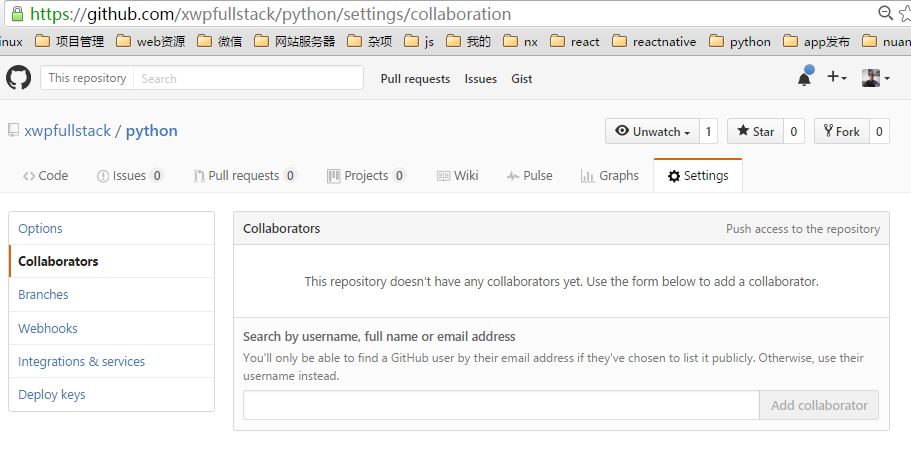

+ 也可以建立一个team 把你的伙伴加到team 然后把项目放到team下

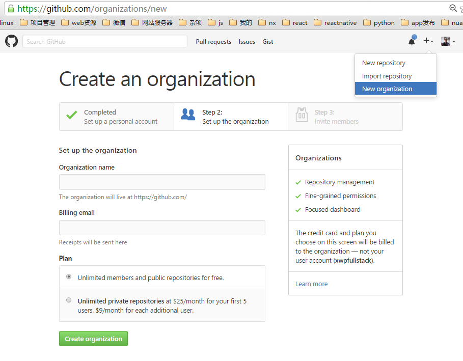

## 发现优秀项目


# 私有git服务器解决方案

+ gitlab
+ gitolite

# 分支设计

master、develop

# 场景

小明笨笨志强

# 实验
